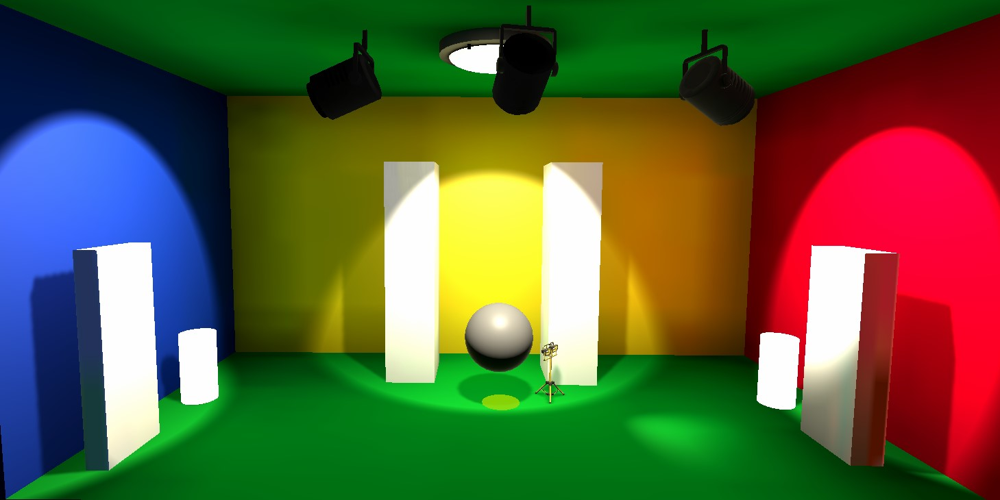
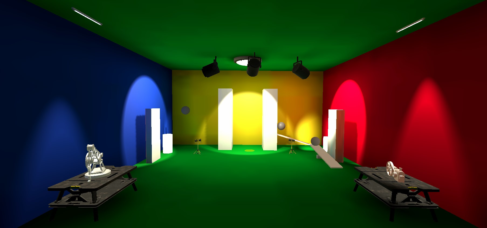

# Unity3D VR Lightbox
The cornell light box created in Unity3D Universal Render Pipeline (URP). 

## Tools

| Software / Package                | Description / Link                                                                                  |
| --------------------------        | ------------------------------------------------------------------------------------- |
| Unity3D 2020.3.21 (LTS)           | https://unity3d.com/get-unity/download/archive                                        |
| Blender 2.9.xx                    | https://www.blender.org/download/                                                     |
| Virtual Reality Toolkit (VRTK)    | https://www.vrtk.io/                                                                  |

  

## Step 1 - Created Cornell Box
Added different light sources, lighting and reflection propes and configured lighting settings for best performance.
Based on LinkedIn Tutorial for [Materials and lighting](https://www.linkedin.com/learning/cert-prep-unity-certified-associate-game-developer-materials-and-lighting/material-and-lighting-foundations?u=68004706).

## Step 2 -  Added VR Support
Integrated VR Tilia Support based on this Tutorial [Bownling Tutorial](https://academy.vrtk.io/Documentation/Tutorials/).
Also integrated a [simple teleport pointer](https://www.youtube.com/watch?v=vf6IQ57Z4mg&list=PLnrrFPvgClViJOfi-2MseS5W2DiKEB551&index=7).

## Step 3 - Animations
Added some animated objects depending on [this](https://www.youtube.com/watch?v=ts24UWC0mY4&t=1s&ab_channel=Makin%27StuffLookGood) Tutorial.
 
To learn how import create and import Animations from 3D Animation Software like maya, into unity, I checked out this [LinkedIn Course](https://www.linkedin.com/learning/unity-5-3d-essential-training/segmenting-imported-animation-into-clips?autoAdvance=true&autoSkip=false&autoplay=true&resume=false&u=68004706).

## Step 4 - Added VR SlideMovement
Integrated  a form of locomotion that allows an object to move around a scene by smoothly gliding along the surface in a forward/backward or side strafing motion.  
Used [this](https://github.com/ExtendRealityLtd/Tilia.Locomotors.AxisMove.Unity/tree/master/Documentation/HowToGuides/AddingSlideMovement) tutorial for direct sliding and
[this tutorial](https://github.com/ExtendRealityLtd/Tilia.Locomotors.AxisMove.Unity/tree/master/Documentation/HowToGuides/AddingSlideMovementWithSnapRotation
) for slide rotation.

## Step 5 - Added a PseudoBody and adjust configuration
Implemented a pseudo body including a collider for the VR Player by following 
[this tutorial](https://github.com/ExtendRealityLtd/Tilia.Trackers.PseudoBody.Unity/tree/master/Documentation/HowToGuides/AddingAPseudoBody) and 
more detailed explanation [here](https://youtu.be/2mjhsP-esjA).

## Step 6 - Added interactables
Added some interactables which can be dragged and dropped again by following
[this tutorial](https://github.com/ExtendRealityLtd/Tilia.Interactions.Interactables.Unity/tree/master/Documentation/HowToGuides/SettingTheOrientationOfAnInteractableWhenGrabbed) and 
more detailed explanation [here](https://youtu.be/ZE-UdW9l2TM).

## License
[MIT](https://choosealicense.com/licenses/mit/)